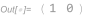
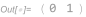
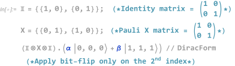
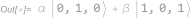

# BernDirac
[](https://www.wolfram.com/language/)
[](https://www.gnu.org/licenses/gpl-3.0)


A [Wolfram Mathematica](https://www.wolfram.com/mathematica/) package for performing calculations involving matrices/vectors in the [Dirac notation](https://en.wikipedia.org/wiki/Bra%E2%80%93ket_notation) which is usually used in [quantum mechanics](https://en.wikipedia.org/wiki/Quantum_mechanics)/[quantum computing](https://en.wikipedia.org/wiki/Quantum_computing). It utilises the *built-in functions without predefined meanings*, namely `Ket[]`, `Bra[]`, and `CircleTimes[]`, along with their respective alias, <code>"| ⟩" → <kbd>esc</kbd>ket<kbd>esc</kbd></code>, <code>"⟨ |" → <kbd>esc</kbd>bra<kbd>esc</kbd></code> and <code>"⊗" → <kbd>esc</kbd>c*<kbd>esc</kbd></code>.

The basis which this package works in is {|0⟩,|1⟩}, which is also known as the *computational basis* or the *Z basis*.

The package was written in Wolfram Mathematica version [12.2](https://www.wolfram.com/mathematica/quick-revision-history.html) in Windows 10.

# How to use?
Download [BernDirac.wl](https://github.com/bernie-wu/BernDirac/blob/main/BernDirac.wl) and place it wherever you like. Then, in your Mathematica notebook, run the following line to load the package into your current Mathematica session:

```wolframlanguage
Get[<path-to-BernDirac.wl>];
```

# Functions that this package provides
After loading [BernDirac.wl](https://github.com/bernie-wu/BernDirac/blob/main/BernDirac.wl) into your Mathematica notebook session, the following additional functions become available to use:  
→[`Ket[]`](#Ket "Go-to Ket[]")  
→[`Bra[]`](#Bra "Go-to Bra[]")  
→[`CircleTimes[]`](#CircleTimes "Go-to CircleTimes[]")  
→[`DiracForm[]`](#CircleTimes "Go-to DiracForm[]")  
→[`PartialTr[]`](#CircleTimes "Go-to PartialTr[]")  

## Ket[]
`Ket[]` is used to denote a *column vector*. The alias `| ⟩` for `Ket[]` can be obtained with <code><kbd>esc</kbd>ket<kbd>esc</kbd></code>.
The allowed input for `Ket[]` is either `0` or `1` and the output for each case is as shown here:

>> ![In:Ket[0]](Image/Ket/ket0_in.svg "Ket[0]")  
>> 
>
>> ![In:Ket[1]](Image/Ket/ket1_in.svg "Ket[1]")  
>> 

`Ket[]` also supports multiple inputs, as long as they are `0` and `1`.

>> ![In:Ket[1,1,0]](Image/Ket/ket110_in.svg "Ket[1,1,0]")  
>
>> ![Out:Ket[1,1,0]](Image/Ket/ket110_out.svg "{{0},{0},{0},{0},{0},{0},{1},{0}}")

Note that `Ket[1,1,0]` is equivalent to `Ket[1]⊗Ket[1]⊗Ket[0]` (see [`CircleTimes[]`](#CircleTimes "Go-to CircleTimes[]")).

## Bra[]
`Bra[]` is used to denote a *row vector* (i.e. `| ⟩=(⟨ |)†` where `†` denotes conjugate transpose). The alias `⟨ |` for `Bra[]` can be obtained with <code><kbd>esc</kbd>bra<kbd>esc</kbd></code>.
The allowed input for `Bra[]` is either `0` or `1` and the output for each case is as shown here:

>> ![In:Bra[0]](Image/Bra/bra0_in.svg "Bra[0]")  
>> 
>
>> ![In:Bra[1]](Image/Bra/bra1_in.svg "Bra[1]")  
>> 

Just like `Ket[]`, `Bra[]` also supports multiple inputs, as long as they are `0` and `1`.

>> ![In:Bra[1,1,0]](Image/Bra/bra110_in.svg "Bra[1,1,0]")  
>
>> ![Out:Bra[1,1,0]](Image/Bra/bra110_out.svg "{{0,0,0,0,0,0,1,0}}")

Note that `Bra[1,1,0]` is equivalent to `Bra[1]⊗Bra[1]⊗Bra[0]` (see [`CircleTimes[]`](#CircleTimes "Go-to CircleTimes[]")).


## CircleTimes[]
The alias `⊗` for `CircleTimes[]`, is used to denote the [*Kronecker product*](https://en.wikipedia.org/wiki/Kronecker_product) (sometimes also called [*Tensor product*](https://en.wikipedia.org/wiki/Tensor_product)). Use <code><kbd>esc</kbd>c*<kbd>esc</kbd></code> to obtain the alias.
Below, we show that `⊗` works for multiple column vectors, row vectors, and square matrices.  
**Column vector**
>> ![In:Ket[1]⊗Ket[1]⊗Ket[0]](Image/Ket/ket110_tensor_in.svg "Ket[1]⊗Ket[1]⊗Ket[0]")  
>
>> ![Out:Ket[1]⊗Ket[1]⊗Ket[0]](Image/Ket/ket110_out.svg "{{0},{0},{0},{0},{0},{0},{1},{0}}")  

**Row vector**
>> ![In:Bra[1]⊗Bra[1]⊗Bra[0]](Image/Bra/bra110_tensor_in.svg "Bra[1]⊗Bra[1]⊗Bra[0]")  
>
>> ![Out:Bra[1,1,0]](Image/Bra/bra110_out.svg "{{0,0,0,0,0,0,1,0}}")  

**Square matrix**
>> ![In:Ket[0].Bra[0]⊗Ket[1].Bra[1]](Image/BraKet/braket00_11_tensor_in.svg "Ket[0].Bra[0]⊗Ket[1].Bra[1]") 
>
>> ![Out:Ket[0].Bra[0]⊗Ket[1].Bra[1]](Image/BraKet/braket00_11_tensor_out.svg "{{{0, 0, 0, 0}, {0, 1, 0, 0}, {0, 0, 0, 0}, {0, 0, 0, 0}}}") 

## DiracForm[]
`DiracForm[]` prints the vector or matrix using the Dirac notation. It works for column vectors, row vectors, and square matrices.  
**Column vector**
>> ![In:αKet[0]⊗Ket[0]+βKet[1]⊗Ket[1]](Image/Ket/αket00_βket11_tensor_dirac_in.svg "αKet[0]⊗Ket[0]+βKet[1]⊗Ket[1]")  
>
>> ![Out:αKet[0]⊗Ket[0]+βKet[1]⊗Ket[1]](Image/Ket/αket00_βket11_tensor_dirac_out.svg "α|0,0⟩+β|1,1⟩")  

**Row vector**
>> ![In:αBra[0]⊗Bra[0]+βBra[1]⊗Bra[1]](Image/Bra/αbra00_βbra11_tensor_dirac_in.svg "αBra[0]⊗Bra[0]+βBra[1]⊗Bra[1]")  
>
>> ![Out:αBra[0]⊗Bra[0]+βBra[1]⊗Bra[1]](Image/Bra/αbra00_βbra11_tensor_dirac_out.svg "α⟨0,0|+β⟨1,1|")  

**Square matrix**
>> ![In:(αKet[0]⊗Ket[0]+βKet[1]⊗Ket[1]).(αBra[0]⊗Bra[0]+βBra[1]⊗Bra[1])](Image/BraKet/αket00_βket11_αbra00_βbra11_tensor_dirac_in.svg "(αKet[0]⊗Ket[0]+βKet[1]⊗Ket[1]).(αBra[0]⊗Bra[0]+βBra[1]⊗Bra[1])")  
>
>> ![Out:(αKet[0]⊗Ket[0]+βKet[1]⊗Ket[1]).(αBra[0]⊗Bra[0]+βBra[1]⊗Bra[1])](Image/BraKet/αket00_βket11_αbra00_βbra11_tensor_dirac_out.svg "α²|0,0⟩.⟨0,0|+αβ|0,0⟩.⟨1,1|+αβ|1,1⟩.⟨0,0|+β²|1,1⟩.⟨1,1|")  

## PartialTr[]
`PartialTr[]` performs partial trace of a given system over the specified indices. This function takes 2 input arguments. The first input must be a *density matrix* (i.e. square matrix). The second input is a list of integer(s) indicating the indices where you would like to perform partial trace over.

>> ![In:PartialTr[αKet[0,1,1].Bra[0,1,1]+βKet[1,1,0].Bra[1,1,0],{1}]](Image/PartialTr/partialtr1_αketbra011_βketbra110_in.svg "PartialTr[αKet[0,1,1].Bra[0,1,1]+βKet[1,1,0].Bra[1,1,0],{1}]")  
>> ![Out:PartialTr[αKet[0,1,1].Bra[0,1,1]+βKet[1,1,0].Bra[1,1,0],{1}]](Image/PartialTr/partialtr1_αketbra011_βketbra110_out.svg "β|1,0⟩.⟨1,0|+α|1,1⟩.⟨1,1|")  
>
>> ![In:PartialTr[αKet[0,1,1].Bra[0,1,1]+βKet[1,1,0].Bra[1,1,0],{1,3}]](Image/PartialTr/partialtr13_αketbra011_βketbra110_in.svg "PartialTr[αKet[0,1,1].Bra[0,1,1]+βKet[1,1,0].Bra[1,1,0],{1,3}]")  
>> ![Out:PartialTr[αKet[0,1,1].Bra[0,1,1]+βKet[1,1,0].Bra[1,1,0],{1,3}]](Image/PartialTr/partialtr13_αketbra011_βketbra110_out.svg "(α+β)|1⟩.⟨1|")  
>
>> ![In:PartialTr[αKet[0,1,1].Bra[0,1,1]+βKet[1,1,0].Bra[1,1,0],{2,3}]](Image/PartialTr/partialtr23_αketbra011_βketbra110_in.svg "PartialTr[αKet[0,1,1].Bra[0,1,1]+βKet[1,1,0].Bra[1,1,0],{2,3}]")  
>> ![Out:PartialTr[αKet[0,1,1].Bra[0,1,1]+βKet[1,1,0].Bra[1,1,0],{2,3}]](Image/PartialTr/partialtr23_αketbra011_βketbra110_out.svg "α|0⟩.⟨0|+β|1⟩.⟨1|")  

# Example
The only file you need is [BernDirac.wl](https://github.com/bernie-wu/BernDirac/blob/main/BernDirac.wl). A Mathematica notebook .nb file showing examples of how to use this package can be found in the [Example](https://github.com/bernie-wu/BernDirac/tree/main/Example) folder.  
**Applying bit-flip on one qubit in a system of 3 qubits**
>>   
>
>>   

* Partial trace
* Some kind of Hamiltonian?

# Who am I and why did I create this package?
At the time of writing this I am a graduate student with homework assignments involved in heavy and tedious quantum mechanics calculations. I created this Mathematica package to ease my life and since it helped me a tonne, I figured I should share this with the public too in case someone is also in the same boat as me.

# TO-DO
 * Write a full fledged example usage within the [readme.md](https://github.com/bernie-wu/BernDirac/blob/main/README.md) itself.
 * Write better *usage* descriptions in [BernDirac.wl](https://github.com/bernie-wu/BernDirac/blob/main/BernDirac.wl).
 * Add more functions to [BernDirac.wl](https://github.com/bernie-wu/BernDirac/blob/main/BernDirac.wl).
